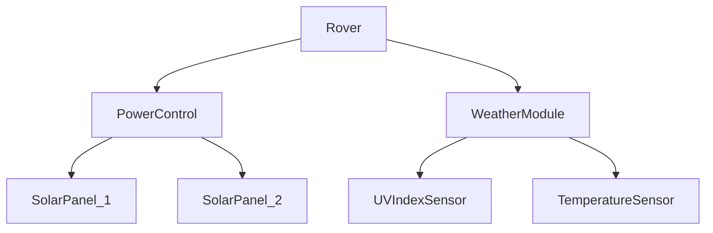

# Union Aerospace Corporation
## Mars Rover expedition

The UAC, unrivaled in its commitment to shareholders,
is devoted to short-term financial performance, no matter what the cost.
As we look beyond our planet for financial gain, rest assured that your investment with
the UAC is working hard for you, here on Earth and abroad.

Following order from Samuel Hayden you are now responsible for fault detection in our
rover expedition.

Here's some information that might be useful for you.

## Rover architecture

### Author annotation

This repository is created to train your skills in testing. It is still in progress,
so will be updated on a daily basis.